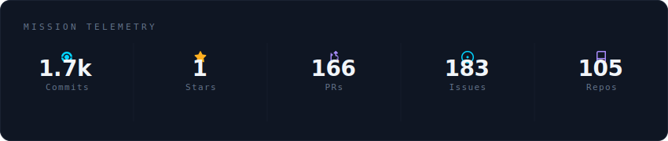

<!-- Galaxy Profile README — gitmonox -->

  

 

  

 

  

 

  

 

  

 

-----

  

-----

 

<strong>Mais sobre mim</strong>

 

Technology Manager com 5+ anos de experiência em desenvolvimento Python e automação de processos.
Arquiteto de APIs REST, plataformas de processamento de faturas e soluções RPA que lidam com desafios como bypass de CAPTCHA e autenticação 2FA.

Atualmente liderando times de desenvolvimento, combinando expertise técnica com gestão de pessoas — desde arquitetar soluções backend até mentorar desenvolvedores e interface direta com clientes.

**Atualmente na** Turing — São Paulo, BR

**Áreas de foco:**
- Backend Development & System Architecture
- Team Leadership & Agile/Scrum Coordination
- Process Automation & Web Scraping at Scale
- Cloud Infrastructure & DevOps

**Liderança técnica:**
- Arquiteturas escaláveis com Docker, Redis e Job Queues
- Bots de automação com Selenium para empresas de utilities
- Integração de sistemas enterprise incluindo SAP

 

  
  
  
  

